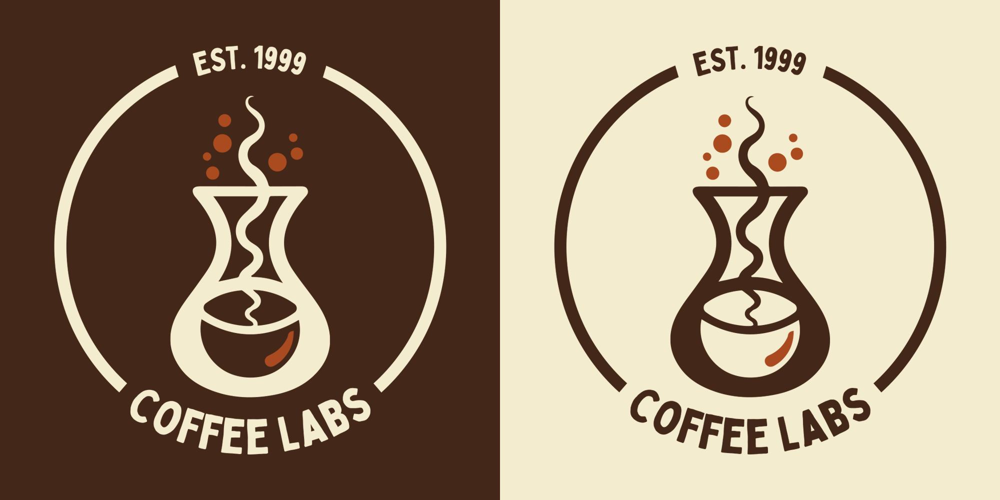
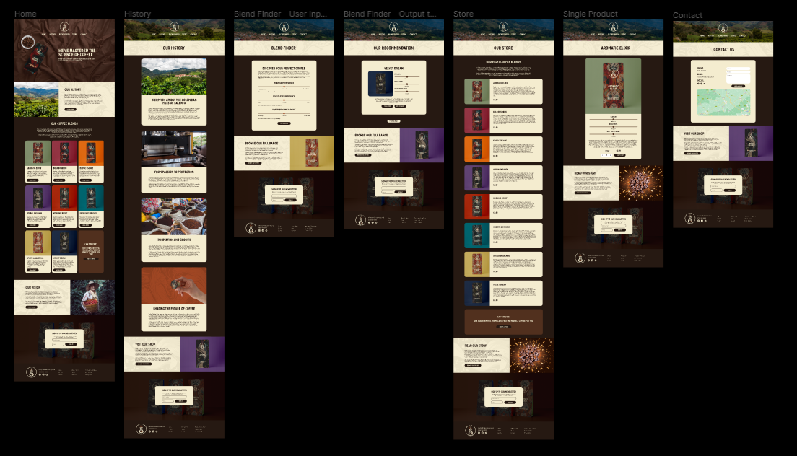
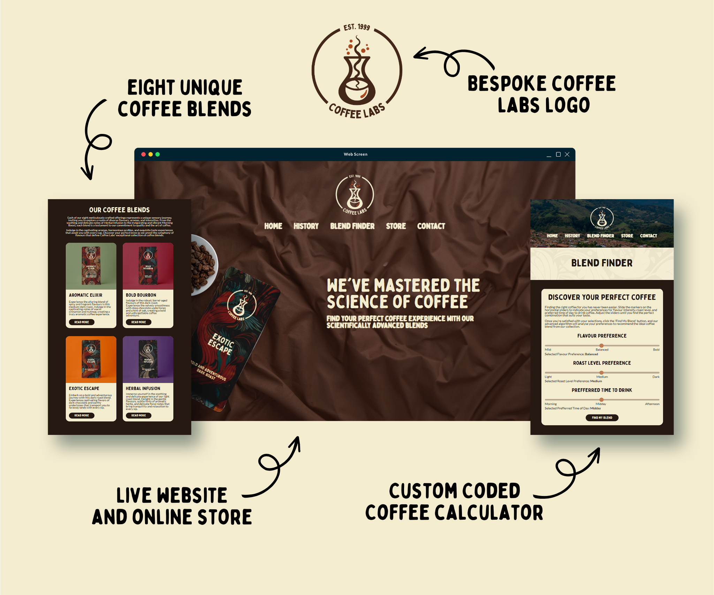

# Custom WordPress Theme Coffee Labs

Having successfully followed a custom wordpress theme development tutorial, I decided to set myself the goal of designing a website from scratch and building it in WordPress with a bespoke theme. I also set the additional goal of implementing a coffee blender finder, which takes the users coffee preferences and recommends them the closest matched blend.

**Live site: [coffee-labs.blake-kj.co.uk](https://coffee-labs.blake-kj.co.uk/)**

## Project Description

### Two Logo Designs (Light & Dark):
I begun the project by designing the logo. In order to do this I used Midjourney to generate a logo concept which I then converted into a vector and edited with Adobe illustrator.

### Eight Coffee Blend Designs:

I then created eight coffee blends for the coffee brand, I prompted ChatGPT to generate these and their associated characteristics. With each blend planned out I used Midjourney and photoshop to create product packaging for each of the eight blends.

### Website Design:

Now with the core of the brand completed, I used Figma to design the website. I used a combination of ChatGPT, Adobe Generative AI and stock images in order to complete the design of the website

### Website Development:

Using the Figma design for reference I built the website locally using WordPress and the Understrap starter theme. I used HTML, PHP, Sass, JavaScript, Bootstrap, WooCommerce and JetEngine.

## What's Next?

Creating this website from scratch was a challenge for me which made me gain a lot of new skills. I now feel comfortable with custom WordPress theme development. I would like to design another website from sratch but next time use a Tailwind started theme such as [_tw](https://underscoretw.com/).
